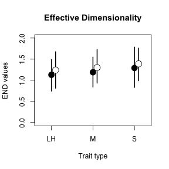
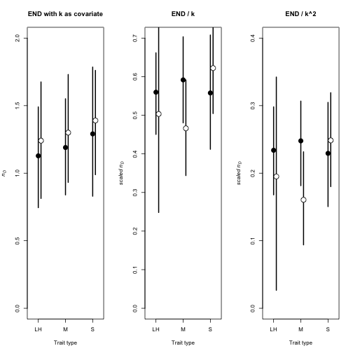
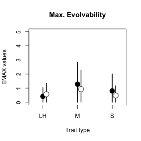
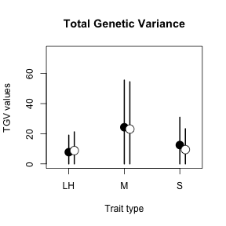
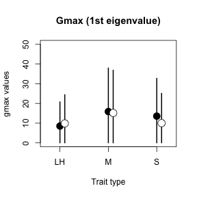
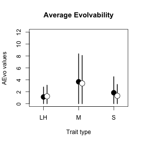
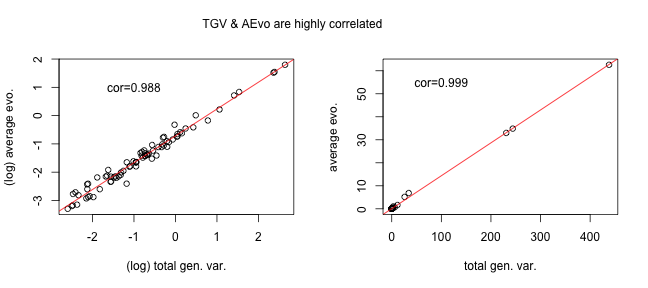
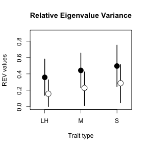
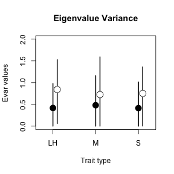
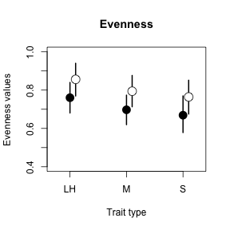

Analysis of tabulated **G** matrices for Pitchers *et al.* 2014
===

This script documents the analyses of **G** matrices from the paper "Evolutionary rates for multivariate traits". For analyses of selection and rate of evolution, see the other associated scripts.

The matrices are stored as csv files in two folders that accompany this script; *"Gmats_&_means_as_CSVs"* are covariance matrices (with trait means) and *"Gmats_Cor_as_CSVs"* are correlation matrices. The file *"MatrixIndexFinal.csv"* is a table that identifies each matrix with the paper from which it came, and contains information on species ID and our classification of trait type for the purpose of analysis.

This first code block simply sets up the working environment; loading the **R** libraries needed and reading in our functions.


----
  
  **Covariance Matrices**
  
  Now to read in the data: we used the following code to read in each of the covariance matrices and compile them into an **R** list object. This object is written out as the file *"covariance_matrix_list.R"* which should be included with this script. You may simply load this file for simplicity, or otherwise please un-comment this code and edit the `setwd()` line to direct **R** to the folder of covariance matrix csv's.


```r
# read_matrices&means
setwd("..//Data/Gmats_&_means_as_CSVs")
matrices <- dir()
no.mats <- length(matrices)
matrix_list <- list()

# this loop reads in each matrix from the folder of .csv files and writes
# them into a list
for (i in 1:no.mats) {
    matrix_list[[i]] <- read.csv(matrices[i])
}
names(matrix_list) <- matrices

# I shall write this list out as an object in order to make it as simple as
# possible for readers
save(matrix_list, file = "covariance_matrix_list.R")
```


Now, we load the covariance matrix list and the index file, calculate the matrix metrics and merge the results into a data frame to be used for analysis. NB; matrices that were reported in a mean-standardized form are parsed as is (these are identified by the 'means' column being zeroes) but otherwise matrices are mean-standardized before calculation of metrics.


```r
setwd("..//Data")

load(file = "covariance_matrix_list.R")

no.mats <- length(matrix_list)  # building empty variables for each metric
END <- numeric(no.mats)
TGV <- numeric(no.mats)
Emax <- numeric(no.mats)
gmax <- numeric(no.mats)
AEvo <- numeric(no.mats)
Even <- numeric(no.mats)

# this loop reads each matrix, calculates each metric and writes them to the
# empty vectors above
for (i in 1:no.mats) {
    matrix.and.means <- as.matrix(matrix_list[[i]])
    means <- matrix.and.means[, 1]
    matrix <- matrix.and.means[, 2:ncol(matrix.and.means)]
    if (sum(means) == 0) {
        st.matrix <- matrix
    } else {
        st.matrix <- StanCovMat(as.matrix(matrix), means)
    }
    diag.matrix <- svd(st.matrix)
    eigen.values <- diag.matrix$d
    TGV[i] <- sum(eigen.values)  # 'total genetic varaince' after Kirkpatrick 2008
    END[i] <- sum(eigen.values/eigen.values[1])  # 'effective no. dimensions' after Kirkpatrick 2008
    Emax[i] <- sqrt(eigen.values[1])  # 'maximum evolvability' after Kirkpatrick 2008
    gmax[i] <- eigen.values[1]  # storing gmax; the first eigenvalue
    AEvo[i] <- mean(eigen.values)  # 'average evolvability' after Hansen & Houle 2008
    lamda_tilde <- abs(eigen.values)/sum(abs(eigen.values))
    Even[i] <- -sum(lamda_tilde * log(lamda_tilde)/log(length(eigen.values)))  # 'eigenvalue eveness' after Agrawal & Stinchcombe 2008 (though note that they intended this metric to be calculated from correlation matrices. see below)
}

Metrics <- data.frame(TGV, END, Emax, gmax, AEvo, Even)
matrices_names <- sub(".csv", "", names(matrix_list))
Metrics$filename <- factor(matrices_names)
# str(Metrics)

# now to read in the csv that holds the ID table
Index <- read.csv("MatrixIndexFinal.csv")
# str(Index)

# merge the metrics with the index
gmats <- merge(Metrics, Index, "filename")
# str(gmats)

# dump columns we don't need for analysis
gmats <- gmats[, c(-10, -17)]
```


Before beginning analysis we removed 7 matrices on grounds of data hygiene. We excluded Two **G** matrices from Sherrard et al. (2009) and one from House & Simmons (2005) because there was no clear way to incorporate their very different trait units. We then plotted the data to find visual outliers. Upon inspection the outliers were found to be from Blows & Higgie (2003) and from Merila & Gustafsson (1996). We could find no flaw in the transcription of the matrices from Merila & Gustafsson (1996) and so these are included, but upon re-reading Blows & Higgie (2003) we found that we were not 100% sure how their reported matrices were arrived at and so we opted to be conservative and excluded this reference. This leaves us with a dataset of 88 **G** matrices.


Some descriptive statistics: mean values of metrics and sample sizes by `taxon2` (i.e. Animal/Plant) and trait.type (Life-history, Morphology or Sexually-selected). Following that, a matrix of correlations among the included **G** matrix metrics.


```
##   taxon2 trait.type  m_TGV m_END m_Emax m_Even m_AEvo m_Trait.no no.rows
## 1      A          L  0.326 1.403  0.352  0.557  0.062       3.79      14
## 2      A          M 25.265 1.531  1.526  0.488  3.701       5.26      38
## 3      A          S  3.757 1.398  1.138  0.416  0.667       7.10      10
## 4      P          L  0.153 1.267  0.347  0.454  0.038       4.00       1
## 5      P          M  0.248 1.167  0.431  0.350  0.083       2.33       3
## 6      P          S  0.848 1.785  0.380  0.668  0.124       4.93      15
##   m_no.families
## 1          76.2
## 2          60.3
## 3          60.8
## 4           NaN
## 5         332.0
## 6         115.9
```

```
##           TGV  END  Emax gmax AEvo  Even trait.no
## TGV      1.00 0.13  0.97 0.96 1.00  0.06     0.17
## END      0.13 1.00  0.05 0.05 0.13  0.82     0.30
## Emax     0.97 0.05  1.00 0.94 0.97 -0.04     0.19
## gmax     0.96 0.05  0.94 1.00 0.96  0.01     0.15
## AEvo     1.00 0.13  0.97 0.96 1.00  0.05     0.17
## Even     0.06 0.82 -0.04 0.01 0.05  1.00    -0.05
## trait.no 0.17 0.30  0.19 0.15 0.17 -0.05     1.00
```

```
##               TGV   END  Emax  gmax  AEvo  Even trait.no no.families
## TGV          1.00 -0.13  0.96  1.00  1.00 -0.14     0.08       -0.01
## END         -0.13  1.00 -0.26 -0.13 -0.13  0.83     0.31        0.12
## Emax         0.96 -0.26  1.00  0.96  0.95 -0.30     0.12       -0.01
## gmax         1.00 -0.13  0.96  1.00  0.99 -0.15     0.08       -0.01
## AEvo         1.00 -0.13  0.95  0.99  1.00 -0.14     0.04       -0.05
## Even        -0.14  0.83 -0.30 -0.15 -0.14  1.00     0.04       -0.05
## trait.no     0.08  0.31  0.12  0.08  0.04  0.04     1.00       -0.01
## no.families -0.01  0.12 -0.01 -0.01 -0.05 -0.05    -0.01        1.00
```


Figure (4 in the MS); a visualization of the relationships among metrics of **G** structure. Note the strong relationships between *tgv*, *emax*, *gmax* and average evolvability (*e* bar).

 


In the following code block we perform model selection for our analysis of 'effective number of dimensions'. For each of the metrics we fit a set of 4 models of increasing complexity, with the simplest including main effects of trait type, taxon and trait number, and a random effect of study ID. We first fit the model set with the `lmer()` function which fits mixed models using maximum likelihood. We then use `BICtab()` to evaluate model fit using the Bayesian information criterion. This gives us an order of preference for our 4 models, which we try to confirm by using a parametric bootstrap to obtain a pseudo-p-value for the comparison of the 'best' model with the next best and so on. Lastly, we fit the same set of models using `MCMCglmm()`, which uses a Bayesian markov chain monte carlo approach, and evaulate the model fit using the deviance information criterion. In all cases we specified deliberately uninformative priors, but found that the resulting estimates were robust to choices of alternate priors.

Where there is agreement between the BIC, BS and DIC evaluations, we use the selected model. Where there is disagreement, we favoured the more complex of the selected models. The estimates we report are posterior means and 95% credible intervals from the Bayesian version of our selected model.

In the case of 'effective number of dimensions' all three measures of model fit agreed in recommending model1: `END ~ trait.type + taxon + trait.no + random( study )`.


Here are the results of our selected model; filled points for estimates for animals, open points for plants, lines are the extent of the 95% credible intervals from the posterior distribution.

 


*Interlude 1*

At this stage we're comparing the patterns of estimates from models that fit Kirkpatrick's 'effective number of dimensions' either as is (with trait number as a covariate), or scaled by trait number, or scaled by the square of trait number. We encountered a number of suggestions about this from reviewers/colleagues. In particular, the issues is whether we should adjust for trait number in an additive (as a linear covariate) or multiplicative (scaling) fashion. Since there isn't an obviously superior way to deal with the issue, these analyses can be found in the supplmental material for the paper.


 


The next code block performs the model selection for 'maximum evolvability'. In this the best fitting model as judged by BIC was model1, but the DIC (Bayesian) approach supported model3. We opted to select model3; the ∆BIC between the models was <5 and the ∆DIC was mauch larger at ~20. Model3 was: `Emax ~ trait.type + taxon2 + trait.no + random(study.code) + random(species)`.


Here are the results of our selected model; filled points for estimates for animals, open points for plants, lines are the extent of the 95% credible intervals from the posterior distribution.

 


The next code block performs the model selection for 'total genetic variance'. In this case the best fitting model as judged by BIC was model2, with the bootstrap supporting model1 and the DIC (Bayesian) approach supporting model3. We opted to select model3. It is worth noting that the estimates from models 2 & 3 were correlated at *r*>0.94. Model3 was: `TGV ~ trait.type + taxon2 + trait.no + random(study.code) + random(species)`.


```
## Warning: convergence code 3 from bobyqa: bobyqa -- a trust region step failed to reduce q
## Warning: convergence code 3 from bobyqa: bobyqa -- a trust region step failed to reduce q
## Warning: convergence code 3 from bobyqa: bobyqa -- a trust region step failed to reduce q
```


Here are the results of our selected model for *tgv*; filled points for estimates for animals, open points for plants, lines are the extent of the 95% credible intervals from the posterior distribution.

 


The next code block performs the model selection for *gmax*, the principal eigenvalue of **G**. In this case the best fitting model as judged by BIC and the bootstrap was model2, with the DIC (Bayesian) approach supporting model3. We opted to select model3. It is worth noting that the estimates from models 2 & 3 were correlated at *r*>0.94. Model3 was: `gmax ~ trait.type + taxon2 + trait.no + random(study.code) + random(species)`.


Here are the results of our selected model for *gmax*; filled points for estimates for animals, open points for plants, lines are the extent of the 95% credible intervals from the posterior distribution.

 


The next code block performs the model selection for 'average evolvability'. In this case the best fitting model as judged by BIC and the bootstrap was model2, with the DIC (Bayesian) approach supporting model3. We opted to select model3. It is worth noting that the estimates from models 2 & 3 were correlated at *r*>0.93. Model3 was: `AEvo ~ trait.type + taxon2 + trait.no + random(study.code) + random(species)`.


Here are the results of our selected model for 'average evolvability'; filled points for estimates for animals, open points for plants, lines are the extent of the 95% credible intervals from the posterior distribution.

 


*Interlude 2*

At this point we compared the values for 'average evolvability' and *tgv*. The relationship between these two **G** structure metrics is strong, and apparent whether or not we log-transform the values.

 


The next code block performs the model selection for 'eigenvalue eveness'. For this metric the BIC, bootstrap and DIC (Bayesian) approaches were all in agreement in supporting model1, which was: `Even ~ trait.type + taxon2 + trait.no + random(study.code)`.


Here are the results of our selected model for 'eigenvalue eveness'; filled points for estimates for animals, open points for plants, lines are the extent of the 95% credible intervals from the posterior distribution as above. NB: "high values of E suggest that genetic variance is evenly distributed among the measured traits".

 


----
  
  **Correlation Matrices**
  
  Now to read in the data for correlation matrices. As with the covariance matrix dataset above, we read in each of the covariance matrices and compiled them into an **R** list object. This object is written out as the file *"correlation_matrix_list.R"* which should be included with this script. Also as before you may simply load this file for simplicity, or opt to rebuild this object by directing **R** to the folder of correlation matrix csv's and running the following code block.


```r
setwd("..//Data//Gmats_Cor_as_CSVs")
matrices <- dir()
no.mats <- length(matrices)
cor_matrix_list <- list()

# this loop reads in each matrix from the folder of .csv files and writes
# them into a list
for (i in 1:no.mats) {
    cor_matrix_list[[i]] <- read.csv(matrices[i])
}
names(cor_matrix_list) <- matrices

# I shall write this list out as an object in order to make it as simple as
# possible for readers
save(cor_matrix_list, file = "correlation_matrix_list.R")
```


Now, we load the covariance matrix list and the index file, calculate the matrix metrics and merge the results into a data frame to be used for analysis.


```r

setwd("..//Data")
load(file = "correlation_matrix_list.R")

no.mats <- length(cor_matrix_list)
REV <- numeric(no.mats)  # allocating empty variables for the 
Even <- numeric(no.mats)
Evar <- numeric(no.mats)
gmax <- numeric(no.mats)

for (i in 1:no.mats) {
    cor.matrix <- as.matrix(cor_matrix_list[[i]])
    diag.matrix <- svd(cor.matrix)
    eigen.values <- diag.matrix$d
    gmax[i] <- eigen.values[1]  # gmax - the principal eigenvalue
    Evar[i] <- sum((eigen.values - 1)^2)/length(eigen.values)  # 'eigenvalue variance' following Pavlicev et al 2009
    REV[i] <- Evar[i]/(length(eigen.values) - 1)  # 'relative eigenvalue variance' following Pavlicev et al 2009
    lamda_tilde <- abs(eigen.values)/sum(abs(eigen.values))
    Even[i] <- -sum(lamda_tilde * log(lamda_tilde)/log(length(eigen.values)))  # 'eigenvalue eveness' after Agrawal & Stinchcombe 2008
}

cor_matrices_names <- sub(".csv", "", names(cor_matrix_list))
REV.mats <- data.frame(REV, Even, Evar, gmax, cor_matrices_names)
REV.mats$filename <- factor(cor_matrices_names)

# reading in the csv that holds the ID table (this may still be in memory,
# but just in case you didn't start from line 1 )
Index <- read.csv("MatrixIndexFinal.csv")
# str(Index)

# merge the metrics with the index
g.cor <- merge(Index, REV.mats, "filename")
# str(g.cor)

# remove uneeded columns
g.cor <- g.cor[, -c(11, 12, 19)]
```


Before starting analyses, we examined the data for visual outliers and double-checked that their values had been transcribed correctly. We also found 4 papers wherein correlations had been estimated as >1; since this could be an indicator of a poorly estimated matrix, we excluded all matrice from these four papers. Furthermore, there were 33 matrices in our dataset that included traits measured in differently scaled units e.g. both mm and mm^2. These matrices were also excluded, leaving us with a dataset of 221 matrices remaining for analysis.


Some descriptive statistics: mean values of metrics and sample sizes by `taxon2` (i.e. Animal/Plant) and trait.type (Life-history, Morphology or Sexually-selected). Following that, a matrix of correlations among the included **G** matrix metrics.


```
##   taxon2 trait.type m_REV m_Even m_Evar m_gmax m_Trait.no no.rows
## 1      A          L 0.258  0.770  1.012  2.537      4.405      42
## 2      A          M 0.440  0.645  1.503  3.050      4.927      82
## 3      A          S 0.319  0.692  1.711  3.628      6.556      27
## 4      P          L 0.134  0.848  0.451  1.954      4.500      14
## 5      P          M 0.186  0.806  0.548  2.073      3.962      26
## 6      P          S 0.260  0.759  1.040  2.693      5.067      30
##   m_no.families
## 1         106.0
## 2          82.0
## 3          46.9
## 4          38.1
## 5          72.4
## 6          93.9
```

```
##             REV   Even   Evar   gmax trait.no
## REV       1.000 -0.549  0.866  0.589   -0.048
## Even     -0.549  1.000 -0.324 -0.388    0.006
## Evar      0.866 -0.324  1.000  0.836    0.319
## gmax      0.589 -0.388  0.836  1.000    0.680
## trait.no -0.048  0.006  0.319  0.680    1.000
```

```
##                REV   Even   Evar   gmax trait.no no.families
## REV          1.000 -0.512  0.887  0.623   -0.050      -0.120
## Even        -0.512  1.000 -0.266 -0.344    0.037       0.151
## Evar         0.887 -0.266  1.000  0.827    0.268       0.033
## gmax         0.623 -0.344  0.827  1.000    0.663       0.275
## trait.no    -0.050  0.037  0.268  0.663    1.000       0.557
## no.families -0.120  0.151  0.033  0.275    0.557       1.000
```


Next, a plot to visualize the relationships among the **G** structure metrics calculated from correlation matrices. This appears as Figure % in the paper.

 


*Interlude 3*

This interlude produces more output for the supplement. We wanted to plot/tabulate the values for numner of traits as they appear in our dataset. While we did not detect any large effects associated with trait number, it is possible that we lack the power to do so since the data that ws available contained a majority of matrices in the size range of 4--6 traits.

Given the well known issue of over-estimating the principal eigenvalues at the expense of the minor ones when the number of "families" used to estimate G is small (see references in paper), we also examined whether number of families was associated with aspects of eigenvalue eveneness, eccentricity and the like. As we point out in the supplement, we did not observe any strong pattern based on these data.

 

```
## 
##  2  3  4  5  6  7  8  9 17 
## 11  8  5 29 16  6  2  3  1
```

```
## 
##  2  3  4  5  6  7  8  9 10 17 
## 31 41 36 42 21 21 17  5  4  3
```

 

```
## [1] "END"         "AEvo"        "Even"        "no.families"
```

 

```
## [1] "REV"         "Even"        "Evar"        "no.families"
```

 


Now we begin analysis for correlation matrices. The next code block performs the model selection for 'relative eigenvalue variance'. As with the analyses of covariance matrices above, we fit the set of 4 models using ML with the `lmer()` function and eveluated their fit with `BICtab()`. We then try to confirm this using a parametric bootstrap and by fitting the same set of models using `MCMCglmm()` and evaulating the model fit using the deviance information criterion. As before we specified deliberately uninformative priors when fitting the Bayesian models. Where there is agreement between the BIC, BS and DIC evaluations, we use the selected model. Where there is disagreement, we favoured the more complex of the selected models. The estimates we report are posterior means and 95% credible intervals from the Bayesian version of our selected model.

In the case of 'relative eigenvalue variance' all three approaches were in agreement in recommending model1 as the best fitting. We thus used the model `REV ~ trait.type + taxon + trait.no + random(study.code)`.


```
## Warning: Model failed to converge: degenerate  Hessian with 1 negative eigenvalues
## Warning: Model failed to converge: degenerate  Hessian with 1 negative eigenvalues
```


Here are the results of our selected model for 'relative eigenvalue variance'; filled points for estimates for animals, open points for plants, lines are the extent of the 95% credible intervals from the posterior distribution as above.

 


For the models of eigenvalue variance, there was less agreement among approaches. The BIC & bootstrap approaches supported model1, but the DIC approach supported model3. The ∆BIC between models 1 & 3 was ~5, whereas the ∆DIC was ~10. We selected model3 which was: `Evar ~ trait.type + taxon + trait.no + random(study.code) + random(species)`.


```
## Warning: convergence code 3 from bobyqa: bobyqa -- a trust region step failed to reduce q
## Warning: Model failed to converge: degenerate  Hessian with 1 negative eigenvalues
```


Here are the results of our selected model for 'relative eigenvalue variance'; filled points for estimates for animals, open points for plants, lines are the extent of the 95% credible intervals from the posterior distribution as above.

 


Our next matrix metric is 'eigenvalue eveness'. Model selection was straighforward here, with all three approaches in concordance in supporting model1 as the best fitting. We therefore went with: `Even ~ trait.type + taxon + trait.no +random(study.code)`.


This plots the results of the eveness analysis - as above filled points for estimates for animals, open points for plants, lines are the extent of the 95% credible intervals from the posterior distribution.

 


This final block of code builds the plots in the form in whiich they appear in the MS.


```r

################################################## This block makes MS-quality plots #######

### this plot is about covariance matrices <- Figure 6 in the paper.
par(mfrow = c(2, 2), mar = c(2, 4, 2, 2))
# animals - filled points ^ #plants - open points v

# top left
EMAXfixed <- apply(EMAX.estimates, 2, mean)
plot(EMAXfixed, type = "n", xaxt = "n", ylab = expression(italic("e"["max"])), 
    xlab = "Trait type", xlim = c(0.7, 3.3), ylim = c(0, 5))
axis(side = 1, c("LH", "M", "S"), at = c(1, 2, 3))

lines(c(1, 1), c(hpd(EMAX.estimates[, 1])), lwd = 2)
lines(c(2, 2), c(hpd(EMAX.estimates[, 2])), lwd = 2)
lines(c(3, 3), c(hpd(EMAX.estimates[, 3])), lwd = 2)
lines(c(1.1, 1.1), c(hpd(EMAX.estimates[, 4])), lwd = 2)
lines(c(2.1, 2.1), c(hpd(EMAX.estimates[, 5])), lwd = 2)
lines(c(3.1, 3.1), c(hpd(EMAX.estimates[, 6])), lwd = 2)
points(1:3, EMAXfixed[1:3], pch = 16, cex = 2)
points(1.1:3.1, EMAXfixed[4:6], pch = 21, bg = "white", cex = 2)

# top right
TGVfixed <- apply(TGV.estimates, 2, mean)
plot(TGVfixed, type = "n", xaxt = "n", ylab = expression(italic("tgv")), xlab = "Trait type", 
    xlim = c(0.7, 3.3), ylim = c(0, 75))
axis(side = 1, c("LH", "M", "S"), at = c(1, 2, 3))

lines(c(1, 1), c(hpd(TGV.estimates[, 1])), lwd = 2)
lines(c(2, 2), c(hpd(TGV.estimates[, 2])), lwd = 2)
lines(c(3, 3), c(hpd(TGV.estimates[, 3])), lwd = 2)
lines(c(1.1, 1.1), c(hpd(TGV.estimates[, 4])), lwd = 2)
lines(c(2.1, 2.1), c(hpd(TGV.estimates[, 5])), lwd = 2)
lines(c(3.1, 3.1), c(hpd(TGV.estimates[, 6])), lwd = 2)
points(1:3, TGVfixed[1:3], pch = 16, cex = 2)
points(1.1:3.1, TGVfixed[4:6], pch = 21, bg = "white", cex = 2)

# bottom left
AEvofixed <- apply(AEvo.estimates, 2, mean)
plot(AEvofixed, type = "n", xaxt = "n", ylab = expression(italic("ē")), xlab = "Trait type", 
    xlim = c(0.7, 3.3), ylim = c(0, 12))
axis(side = 1, c("LH", "M", "S"), at = c(1, 2, 3))

lines(c(1, 1), c(hpd(AEvo.estimates[, 1])), lwd = 2)
lines(c(2, 2), c(hpd(AEvo.estimates[, 2])), lwd = 2)
lines(c(3, 3), c(hpd(AEvo.estimates[, 3])), lwd = 2)
lines(c(1.1, 1.1), c(hpd(AEvo.estimates[, 4])), lwd = 2)
lines(c(2.1, 2.1), c(hpd(AEvo.estimates[, 5])), lwd = 2)
lines(c(3.1, 3.1), c(hpd(AEvo.estimates[, 6])), lwd = 2)
points(1:3, AEvofixed[1:3], pch = 16, cex = 2)
points(1.1:3.1, AEvofixed[4:6], pch = 21, bg = "white", cex = 2)

# bottom right
ENDfixed <- apply(END.estimates, 2, mean)
plot(ENDfixed, type = "n", xaxt = "n", ylab = expression(italic("n"["D"])), 
    xlab = "Trait type", xlim = c(0.7, 3.3), ylim = c(0, 2))
axis(side = 1, c("LH", "M", "S"), at = c(1, 2, 3))

lines(c(1, 1), c(hpd(END.estimates[, 1])), lwd = 2)
lines(c(2, 2), c(hpd(END.estimates[, 2])), lwd = 2)
lines(c(3, 3), c(hpd(END.estimates[, 3])), lwd = 2)
lines(c(1.1, 1.1), c(hpd(END.estimates[, 4])), lwd = 2)
lines(c(2.1, 2.1), c(hpd(END.estimates[, 5])), lwd = 2)
lines(c(3.1, 3.1), c(hpd(END.estimates[, 6])), lwd = 2)
points(1:3, ENDfixed[1:3], pch = 16, cex = 2)
points(1.1:3.1, ENDfixed[4:6], pch = 21, bg = "white", cex = 2)

############################### 

### this plot is about correlation matrices <- Figure 7 in the paper.
par(mfrow = c(1, 3), mar = c(2, 4, 2, 2))
# animals - filled points ^ #plants - open points v

# left panel
REVfixed <- apply(REV.estimates, 2, mean)
plot(REVfixed, type = "n", xaxt = "n", ylab = expression(italic(paste("Var"["rel"], 
    "(λ)"))), xlab = "Trait type", xlim = c(0.7, 3.3), ylim = c(0, 0.9))
axis(side = 1, c("LH", "M", "S"), at = c(1, 2, 3))

lines(c(1, 1), c(hpd(REV.estimates[, 1])), lwd = 2)
lines(c(2, 2), c(hpd(REV.estimates[, 2])), lwd = 2)
lines(c(3, 3), c(hpd(REV.estimates[, 3])), lwd = 2)
lines(c(1.1, 1.1), c(hpd(REV.estimates[, 4])), lwd = 2)
lines(c(2.1, 2.1), c(hpd(REV.estimates[, 5])), lwd = 2)
lines(c(3.1, 3.1), c(hpd(REV.estimates[, 6])), lwd = 2)
points(1:3, REVfixed[1:3], pch = 16, cex = 2)
points(1.1:3.1, REVfixed[4:6], pch = 21, bg = "white", cex = 2)

# middle panel
Evarfixed <- apply(Evar.estimates, 2, mean)
plot(Evarfixed, type = "n", xaxt = "n", ylab = expression(italic(paste("Var(λ)"))), 
    xlab = "Trait type", xlim = c(0.7, 3.3), ylim = c(0, 2))
axis(side = 1, c("LH", "M", "S"), at = c(1, 2, 3))

lines(c(1, 1), c(hpd(Evar.estimates[, 1])), lwd = 2)
lines(c(2, 2), c(hpd(Evar.estimates[, 2])), lwd = 2)
lines(c(3, 3), c(hpd(Evar.estimates[, 3])), lwd = 2)
lines(c(1.1, 1.1), c(hpd(Evar.estimates[, 4])), lwd = 2)
lines(c(2.1, 2.1), c(hpd(Evar.estimates[, 5])), lwd = 2)
lines(c(3.1, 3.1), c(hpd(Evar.estimates[, 6])), lwd = 2)
points(1:3, Evarfixed[1:3], pch = 16, cex = 2)
points(1.1:3.1, Evarfixed[4:6], pch = 21, bg = "white", cex = 2)

# right panel
Evenfixed <- apply(Even.estimates, 2, mean)
plot(Evenfixed, type = "n", xaxt = "n", ylab = expression(italic("E"["λ"])), 
    xlab = "Trait type", xlim = c(0.7, 3.3), ylim = c(0.4, 1))
axis(side = 1, c("LH", "M", "S"), at = c(1, 2, 3))

lines(c(1, 1), c(hpd(Even.estimates[, 1])), lwd = 2)
lines(c(2, 2), c(hpd(Even.estimates[, 2])), lwd = 2)
lines(c(3, 3), c(hpd(Even.estimates[, 3])), lwd = 2)
lines(c(1.1, 1.1), c(hpd(Even.estimates[, 4])), lwd = 2)
lines(c(2.1, 2.1), c(hpd(Even.estimates[, 5])), lwd = 2)
lines(c(3.1, 3.1), c(hpd(Even.estimates[, 6])), lwd = 2)
points(1:3, Evenfixed[1:3], pch = 16, cex = 2)
points(1.1:3.1, Evenfixed[4:6], pch = 21, bg = "white", cex = 2)

##### 
```

