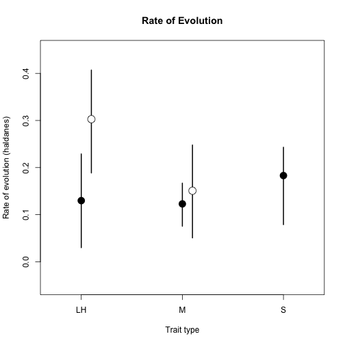
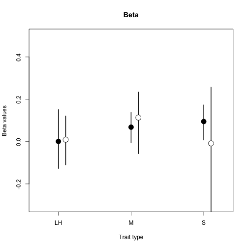
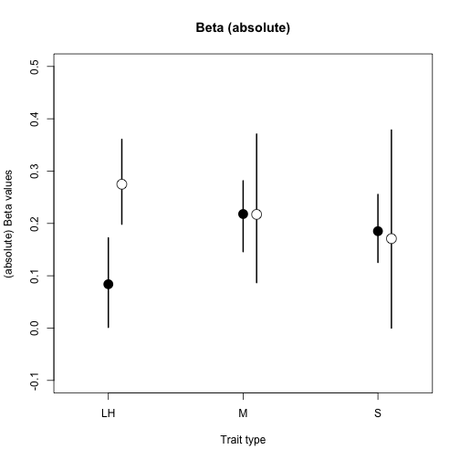

Analysis of Rates of Evolution and Selection gradients for Pitchers *et al.* 2014
===

This script documents the analyses of rates of evolution and of selection gradients from the paper "Evolutionary rates for multivariate traits". For analyses of [**G** matrices, see the other associated scripts](./gmax_analysis.Rmd).
s
This script is divided into to sections; the first for rates of evolution and the second for selection gradients.

---

***Rates of Evolution***

This first code block simply sets up the working environment; loading the **R** libraries needed and reading in our functions.


The dataset of rates of evolution is stored as *"All_rates_Haldanes.csv"*. Here we'll read in the data and make a couple of parsing steps; firstly we exclude traits that were classified as physiology/behaviour (marked by 'P' in the 'Trait.type' column), then we re-factor Trait.type so that these measures won't remain as NA's and lastly we make an 'absRate' column for absolute values of rate of evolution.


```r
response <- read.csv("../Data/All_rates_Haldanes.csv")

response <- response[response$Trait.type != "P", ]

response$Trait.type <- factor(response$Trait.type)

response$absRate <- abs(response$Rate)

# str(response) head(response)
```


Next we checked the data for outliers and oddities that might indicate an error in data entry or similar. We find no obvious errors, thought there are 2 rates measures that are visual outliers. These do not appear to be in error, but are both from the same study, which was one of the experimental evolution studies. Though experimental/natural evolution is not a very strong predictor for rate ( 0.0161 ), this underlines that we need to account for this effect in our models.


Let's have a look at some summary statistics. Note that there are comparatively few estimates for plants, and no estimates for sexually selected traits in plants. Initially we modelled all the data together, but found that these small and incomplete samples made the results of our models unstable. We therefore separated the data into 'responseA' and 'responseP' dataframes (animals & plants respectively).


```
##   Taxon2 Trait.type count  Mean Gmean Median   Mode
## 1      A          L   781 0.028 0.009  0.009 0.0100
## 2      A          M  1667 0.039 0.008  0.007 0.0000
## 3      A          S    90 0.155 0.029  0.022 0.0530
## 4      P          L     7 0.304 0.154  0.298 0.0315
## 5      P          M    26 0.099 0.028  0.032 0.0066
```


Now we'll fit some models. In a similar fashion to our analyses of **G** matrix metrics, we fit a suite of models of increasing complexity using both REML (with the `lmer()` function) and Bayesian (using `MCMCglmmm()`) approaches. We then used BIC and DIC respectively to evaluate the goodness of fit of these models. We also used a parametric bootstrap to estimate p-values for the comparison of each model with the next best and so on. Where there is agreement between our three approaches to evaluating model fit, we use the selected model. Where there is disagreement, we favoured the more complex of the selected models. The estimates we report are posterior means and 95% credible intervals from the Bayesian version of our selected model. This next code block performs the model selection for the Animal rate data.


For the above code, evaluating the REML model fits with BIC (and AIC) indicates that the simplest model -- fitting only an intercept and random effects of study & species -- was the best fitting. However, comparison using the parametric bootstrap indicates model3 and DIC (Bayesian approach) is in agreement. We therefore report estimates from the model `absRate ~ Trait.type + Natural/Exper. + random(Trait.type|Species) + random(Study)`. This figure illustrates the estimates and 95% credible intervals from the model. Since the model includes an effect for natural vs. experimental evolution, but this effect is not one of those we wish to interpret, we weight the estimate of the intercept by the sample sizes of natural and experimental evolution data.

 


And now this next code block performs the  model selection procedure for the rate data from Plants. The set of models is slightly different here because none of our rate estimates for plants came from experimental evolution studies, and so we did not fit a natural/experimental effect. In this case all three model comparison approaches agreed the best fitting model was `absRate ~ Trait.type + random(Species)`.


This figure (Figure 2 in the paper) is a redrawing of the previous figure, but adding estimates and 95% CI's for plants too.

 


---

***Selection Gradients***

Since we inherit the working environment from the previous analyses we do not need to load **R** libraries and functions again. If you wish to start here however, please run the first code block in this script.

Here we read in the selection gradient data, and parse the 3-level (invertebrate, vertebrate, plant) 'Taxon' variable into the 2-level 'Taxon2'.


We now examine the data, and remove two suspicious outliers, before calling for summary information for tables.


```
##  [1] "Dbase"      "StudyID"    "Taxon"      "Trait.type" "Beta"      
##  [6] "Beta_SE"    "abs_Beta"   "Gamma"      "Gamma_SE"   "GamPos"    
## [11] "GamNeg"     "Species"    "Taxon2"
```

  

```
## [1] "counts of gradients"
```

```
##   Taxon2 Trait.type n_abs_Beta n_GamPos n_GamNeg
## 1      A          L        100       13       17
## 2      A          M        559      102      128
## 3      A          S        452      160      165
## 4      P          L        274      114       96
## 5      P          M        132       21       46
## 6      P          S        250       35       10
```

```
## [1] "means of gradients"
```

```
##   Taxon2 Trait.type m_abs_Beta m_GamPos m_GamNeg
## 1      A          L     0.6667  0.08667  0.11333
## 2      A          M     0.8184  0.14934  0.18741
## 3      A          S     0.6828  0.24169  0.24924
## 4      P          L     0.8278  0.34441  0.29003
## 5      P          M     0.9496  0.15108  0.33094
## 6      P          S     0.7205  0.10086  0.02882
```

```
## [1] "geometric means of gradients"
```

```
##   Taxon2 Trait.type gm_abs_Beta gm_GamPos gm_GamNeg
## 1      A          L     0.08355   0.02765   0.04632
## 2      A          M     0.10637   0.07939   0.07229
## 3      A          S     0.09913   0.10807   0.09992
## 4      P          L     0.11555   0.05047   0.03595
## 5      P          M     0.06913   0.01343   0.01878
## 6      P          S     0.13000   0.11635   0.17845
```

```
## [1] "medians of gradients"
```

```
##   Taxon2 Trait.type me_abs_Beta me_GamPos me_GamNeg
## 1      A          L      0.0800    0.0200   -0.0400
## 2      A          M      0.1270    0.1100   -0.0725
## 3      A          S      0.1225    0.1615   -0.1240
## 4      P          L      0.1480    0.0500   -0.0320
## 5      P          M      0.0710    0.0170   -0.0260
## 6      P          S      0.1700    0.1000   -0.1850
```


When it comes to the analysis we are following the lead of Kingsolver et al. (2012) and fitting a formal meta-analysis. In order to do this, we subset the data, retaining only those gradients for which standard errors were available. We then use the square of these SE's as measurement error weightings in the model; `Beta ~ trait type * taxon2 + random(study) + random(species), measurement_error_variance=SE^2`.


This analysis is perhaps not the most suitable for our purposes -- we can see that some traits seen to experience more variable linear selection gradients in plants than in animals, but the estimates are hovering close to zero because there are both positive and negative gradients in the dataset.

 


We therefore fit the same model to the Beta values expressed in absolute terms.


This figure (Figure 3 in the paper) is a lot easier to interpret. We can see that the faster rates we saw for plant life-history (above) are matched by stronger directional selection gradients. In contrast, we see that the strength of directional selection is similar for morphology and sexually-selected traits in animals, and weaker for life-history; a different pattern than the one we observed for rates of evolution (see above).

 


Though only the analysis of linear selection gradients (betas) was included in the paper, we also tabulated quadratic selection gradients, which measure potentially stabilising or disruptive selection. These gradients had been estimated less frequently, so there was a smaller dataset to work with.

We modelled positive and negative quadratic gradients separately, using the same meta-analytic model as we employed for the beta data above. Firstly, we modelled positive (potentially disruptive) gradients.

 


We then modelled negative (potentially stabilising) gradients in the same way, but expressed the gradients as absolute values for ease of comparison.

 


These figures feature in the supplemental material for paper.

